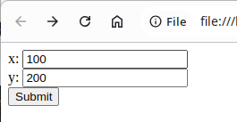

# 用法回顾

在之前的章节中已经演示过通过查询字符串（Query String）的方式向服务器发送数据。方法为在URL的末尾添加`?`后追加多个`key=value`的键值对，以`&`作为分隔符。如果只有一个键值对，则无需分隔符。例如：

```shell
$ curl 'http://localhost:8080/?foo=bar'

================================
Request 4
================================

GET /?foo=bar HTTP/1.1
Host: localhost:8080
Accept: */*
User-Agent: curl/8.10.0
```

```shell
$ curl 'http://localhost:8080/?x=1&y=2'

================================
Request 5
================================

GET /?x=1&y=2 HTTP/1.1
Host: localhost:8080
Accept: */*
User-Agent: curl/8.10.0
```

# 通过HTML提交

也可以通过构造一个HTML表单，通过浏览器来发送查询字符串。先创建一个HTML文件，其中包含一个表单：

```html
<html>
  <head>
    <title>form GET test</title>
  </head>
  <body>
    <form action="http://localhost:8080/" method="get">
      <div>x: <input name="x" /></div>
      <div>y: <input name="y" /></div>
      <div><button type="submit">Submit</button></div>
    </form>
  </body>
</html>
```

- `form`元素包裹的区域为表单主体
- `action`属性指定了表单提交的目标URL
- `method`属性指定了提交时发送请求的方法

表单中可以包含多种字段元素，在这里只给出了`input`元素的示例，它表示一个文本输入框，其`name`属性表示表单提交时，发送数据的字段名称，而值则为该文本框中填入的值。

用浏览器打开该HTML文件，会显示类似如下的界面：



假设在“x”中填入“100”，在“y”中填入“200”，然后点击提交，你将看到回显服务器给出的请求信息回显：

```
================================
Request 9
================================

GET /?x=100&y=200 HTTP/1.1
Host: localhost:8080
（略）
```

和手工拼接查询字符串发送给服务器的效果一致。

# 键值对编码

如键或值中出现URL元字符，例如`&`、`=`、`+`、`%`等，需要将其编码为`%`+字节16进制表示，在后续表单提交章节也会涉及同样的编码问题。

假设在表单字段“x”中填入`A&B|C`，“y”中填入`Tom&Jerry`，提交后可以看到如下回显

```
================================
Request 10
================================

GET /?x=A%26B%7CC&y=Tom%26Jerry HTTP/1.1
Host: localhost:8080
（略）
```
