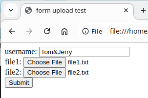

# 上传文件

## 用HTML表单上传文件

让我们再次通过 HTML 的例子来学习上传文件时的请求格式。先构建一个上传用的 HTML 页面：

```html
{{#include source/form-upload.html}}
```

从代码中我们可以注意到上传文件所需的要求：

- 方法为`POST`
- 编码方式`multipart/form-data`

表单中还增加了2个`type`属性为`file`的`input`元素，其表现形式为文件选择框，它允许用户选择本地文件用于上传

再准备2个文件用于上传测试：

```shell
$ cat << EOF > /tmp/file1.txt
line 1 of file 1
line 2 of file 1
line 3 of file 1
EOF

$ cat << EOF > /tmp/file2.txt
line 1 of file 2
line 2 of file 2
line 3 of file 2
EOF
```

用浏览器打开HTML页面，填写文本字段，点击文件输入框选择相应文件，如下图所示：



提交后得到如下回显：

```
================================
Request 5
================================

POST / HTTP/1.1
Host: localhost:8080
Content-Length: 530
Content-Type: multipart/form-data; boundary=----WebKitFormBoundaryjJii9Dn6GejdGMjK
（略）

------WebKitFormBoundaryjJii9Dn6GejdGMjK
Content-Disposition: form-data; name="username"

Tom&Jerry
------WebKitFormBoundaryjJii9Dn6GejdGMjK
Content-Disposition: form-data; name="file1"; filename="file1.txt"
Content-Type: text/plain

line 1 of file 1
line 2 of file 1
line 3 of file 1

------WebKitFormBoundaryjJii9Dn6GejdGMjK
Content-Disposition: form-data; name="file2"; filename="file2.txt"
Content-Type: text/plain

line 1 of file 2
line 2 of file 2
line 3 of file 2

------WebKitFormBoundaryjJii9Dn6GejdGMjK--
```

从中可以发现一些特点：

- `Content-Type`为`multipart/form-data`，与HTML表单中声明的`enctype`属性值一致，且跟随一个随机的`boundary`用于多个字段间的分割字符串。
- 每个字段都占用一个part，part以`--`+boundary分隔符开始，用于和上一个part分割
- 上一个part末尾和下一个part开始之前的换行符仅用于part之间的分割，不是字段内容的一部分
- 最后一个part之后是`--`+boundary分隔符+`--`，代表之后没有更多part了
- 每个part都有自己的私有头部
- 私有头部`Content-Disposition`值为`form-data`，其后跟随`name`表明字段名称
- 由于一个part仅表示一个字段，且字段名称已在私有头部体现，part的主体部分就无需额外编码了，直接以原始形式表示。
- 文件字段的`Content-Disposition`头会有一个额外的`filename`属性用于表示用户上传时的本地文件名。在有后端逻辑的服务器上，可以把文件保存到存储设备上（丢弃文件名或按内部实现重命名），然后在UI界面上依旧显示用户之前上传时使用的文件名
- 文件字段的值即文件的内容，所以可以是任意的二进制字节序列，并不仅限于可打印字符，通过回显服务器回显有可能会得到乱码
- 显然文件本身的内容不能和`boundary`的值有冲突，否则part会意外中断，后续数据格式不合法从而导致解析失败。浏览器会通过一定的算法最大限度地保证分隔符的唯一性

## 用curl上传表单

### 手动构造multipart/form-data

根据HTML提交的上传内容，我们可以手动构造curl上传文件请求的底层数据。先将回显的主体部分（首个`--`+boundary分隔符到末尾）的内容保存成一个外部数据文件：

```shell
$ cat << EOF > /tmp/body.txt
------WebKitFormBoundaryjJii9Dn6GejdGMjK
Content-Disposition: form-data; name="username"

Tom&Jerry
------WebKitFormBoundaryjJii9Dn6GejdGMjK
Content-Disposition: form-data; name="file1"; filename="file1.txt"
Content-Type: text/plain

line 1 of file 1
line 2 of file 1
line 3 of file 1

------WebKitFormBoundaryjJii9Dn6GejdGMjK
Content-Disposition: form-data; name="file2"; filename="file2.txt"
Content-Type: text/plain

line 1 of file 2
line 2 of file 2
line 3 of file 2

------WebKitFormBoundaryjJii9Dn6GejdGMjK--
EOF
```

然后用curl提交，指定`Content-Type`，注意`boundary`要和数据文件中的保持一致。

为避免curl将数据合并成一行（模拟HTML表单提交行为），这里需要用`--data-binary`而不是`--data`以保证curl不对数据作额外处理。

```shell
$ curl \
-X POST \
-H 'Content-Type: multipart/form-data; boundary=----WebKitFormBoundaryjJii9Dn6GejdGMjK' \
--data-binary @/tmp/body.txt \
http://localhost:8080
```

回显内容与之前通过HTML上传的一致。

### 通过curl选项自动构造multipart/form-data

直接构造底层数据太过于繁琐且不灵活，curl提供了`-F`或`--form`选项来方便地构造multipart/form-data，且请求自动以POST方法发出。

注意引用外部文件的格式，字段名后跟随`=`，然后才是`@data_file`，而其他指定外部数据的选项格式中不包含`=`。

```shell
$ curl \
-F 'username=Tom&Jerry' \
-F 'file1=@/tmp/file1.txt' \
-F 'file2=@/tmp/file2.txt;filename=second.txt' \
-F 'file3="file3 content";filename=file3.txt' \
-F 'file4="<html><body><p>hello</p></body></html>";filename=file4.html;type=text/html' \
http://localhost:8080

================================
Request 3
================================

POST / HTTP/1.1
Host: localhost:8080
Accept: */*
Content-Length: 910
Content-Type: multipart/form-data; boundary=------------------------fsssj9Z51j8F20ehccWw2K
User-Agent: curl/8.10.0

--------------------------fsssj9Z51j8F20ehccWw2K
Content-Disposition: form-data; name="username"

Tom&Jerry
--------------------------fsssj9Z51j8F20ehccWw2K
Content-Disposition: form-data; name="file1"; filename="file1.txt"
Content-Type: text/plain

line 1 of file 1
line 2 of file 1
line 3 of file 1

--------------------------fsssj9Z51j8F20ehccWw2K
Content-Disposition: form-data; name="file2"; filename="second.txt"
Content-Type: text/plain

line 1 of file 2
line 2 of file 2
line 3 of file 2

--------------------------fsssj9Z51j8F20ehccWw2K
Content-Disposition: form-data; name="file3"; filename="file3.txt"
Content-Type: text/plain

file3 content
--------------------------fsssj9Z51j8F20ehccWw2K
Content-Disposition: form-data; name="file4"; filename="file4.html"
Content-Type: text/html

<html><body><p>hello</p></body></html>
--------------------------fsssj9Z51j8F20ehccWw2K--
```

- `-F 'username=Tom&Jerry'`构造了一个字段，字段名为`username`，它没有文件名属性
- `-F 'file1=@/tmp/file1.txt'`构造了一个文件字段，字段名为`file1`，值从`/tmp/file1.txt`加载，文件名属性由curl自动推导，为`file1.txt`
- `-F 'file2=@/tmp/file2.txt;filename=second.txt'`构造了一个文件字段，字段名为`file2`，值从`/tmp/file2.txt`加载，显式指定文件名属性为`second.txt`
- `-F 'file3="file3 content";filename=file3.txt'`构造了一个文件字段，字段名为`file3`，值为`file3 content`，显式指定文件名属性为`file3.txt`
- `-F 'file4="<html><body><p>hello</p></body></html>";filename=file4.html;type=text/html'`构造了一个文件字段，字段名为`file4`，值为HTML源代码，显式指定文件名属性为`file4.html`，且通过`type`属性指定了私有头部`Content-Type: text/html`

需要注意的是，目前网上许多网盘服务并不使用标准的multipart/form-data格式上传文件，他们一般有定制的私有协议。

### 上传文件到EHFS服务器

为了验证我们构造的multipart/form-data数据格式正确，这次使用第二款用于练习的服务器：EHFS接受文件上传，看看上传后的文件是否有效。

假设我们将把本地目录`/tmp/upload`用于共享，且允许用户上传文件：

```shell
$ mkdir /tmp/upload
$ ehfs --listen 8081 --root /tmp/upload --upload /
```

再打开一个新的终端，先确认目录中没有文件：

```shell
$ ls /tmp/upload/
```

然后使用`file`字段指定要上传的文件：

```shell
$ curl \
-F 'file="hello world";filename=file1.txt' \
-F 'file="foo bar";filename=file2.txt' \
'http://localhost:8081/?upload'
```

验证文件是否正确上传：

```shell
$ ls /tmp/upload/
file1.txt  file2.txt

$ cat /tmp/upload/file1.txt
hello world
$ cat /tmp/upload/file2.txt
foo bar
```

注意由于上传文件内容中没有换行符，显示文件内容会和下一行shell提示符黏连在一起。
